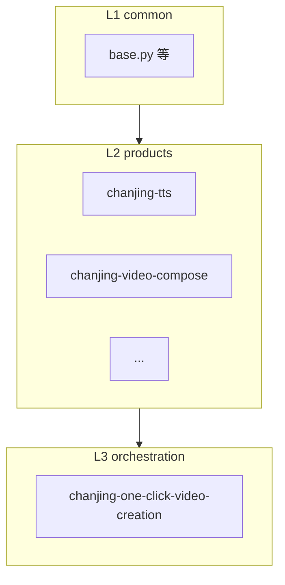

# 架构与目录说明

## 1. 分层模型



- **L1**：被所有 L2 脚本（及少数 L3 内联逻辑）复用。  
- **L2**：单一蝉镜产品能力，手册 + `scripts/`。  
- **L3**：组合多个 L2（通常通过子进程调用各 `scripts/`），可有自有 `scripts/`、`templates/`、`tests/`。

---

## 2. `common/` 模块职责（当前）

| 模块 | 职责摘要 |
|------|-----------|
| `base.py` | 本地凭证读写与刷新、`resolve_chanjing_access_token`、无 token 的 `request_json`、`poll_until`、`run_skill_script`、能力目录辅助函数等 |
| `exceptions.py` | `SkillError` 体系 |
| `logger.py` | 日志 |
| `open_api_client.py` | 带 `access_token` 头的 Open API GET/POST |
| `file_upload.py` | 创建上传 URL、PUT、`file_detail` 轮询、整文件上传编排 |
| `asset_download.py` | 将结果 URL 下载到 `outputs/<子目录>` |
| `open_ai_creation.py` | AI 创作任务相关 API 与状态常量 |
| `open_aigc_person.py` | 文生数字人 photo/motion/lora 相关 API 与状态常量 |

产品侧 `_task_api.py` 等可保留**薄兼容层**，转发到上述模块。

---

## 3. 典型产品目录（L2）

```
products/<product-name>/
├── <product-name>_SKILL.md    # 手册：场景、参数、示例
├── reference.md / examples.md  # 可选
└── scripts/
    ├── _auth.py               # 与 common/base 对齐的凭证入口
    ├── cli_capabilities.py    # 能力目录 + 可选 run_skill_script
    └── <无后缀或 .py CLI>      # 实际调用蝉镜 API 或本地工具
```

---

## 4. 典型编排目录（L3）

```
orchestration/<scene-name>/
├── <scene-name>_SKILL.md      # 唯一场景手册（路由级）
├── README.md                  # 长文、速查、FAQ（非第二份路由）
├── CONTRACT_SKILL.md          # 全局在上一级；交叉引用运行时契约
├── examples/                  # workflow 契约与示例 JSON
├── templates/                 # 提示词、规则稿（一键成片等）
├── tests/                     # 可选
└── scripts/
    ├── _auth.py               # 可选；与 L2 同形，供进程内取 token
    ├── cli_capabilities.py
    ├── run_render.py          # 或其它主编排脚本
    └── validate_*.py 等
```

---

## 5. 编排与产品的协作方式

- **子进程**：L3 常用 `subprocess` 调用 `products/<x>/scripts/<name>`，与用户在终端直接执行等效，凭证仍走各脚本或共享 `~/.chanjing/credentials.json`。  
- **进程内**：少数场景（如 `run_render.py` 轮询 TTS）在同一 Python 进程内调用 `resolve_chanjing_access_token`；此时使用 **本场景 `scripts/_auth.py`**，与 L2 目录结构对齐。

更多能力级说明见 [功能引导](./features-guide.md)。
