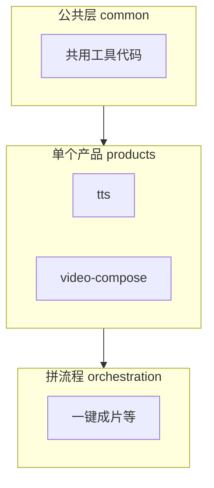

# 架构说明

这里讲 **人怎么上手**：代码在哪、和 AI 用的规则怎么分工、仓库长什么样。  
**注意**：`develop/` **不会**装进技能包；对外安装的是 [`skills/chanjing-content-creation-skill/`](../skills/chanjing-content-creation-skill/)。

---

## `rule.md` 和本目录怎么分？

- **[`skills/rule.md`](../skills/rule.md)** → 给 **AI / Agent**：目录怎么摆、能不能改名、哪些绝对不能做。人要大改结构时打开对一下，不用背全文。  
- **`develop/`** → 给 **你**：分层是啥、`common` 有啥、加产品还是加编排、写脚本习惯、去哪找 TTS/成片。  

让 AI 改仓库时，最好把 **`skills/rule.md`** 一并放进上下文。

**同目录还有：** [开发习惯.md](./开发习惯.md)（写代码约定、提交检查）· [功能索引.md](./功能索引.md)（找文件夹、本机准备）。用法说明见 [`docs/`](../docs/)。

---

## 仓库里长这样

```
content-creation-skills/
├── develop/          ← 给人看的开发说明（本目录）
├── docs/             ← 使用说明、最佳实践
├── skills/
│   ├── rule.md       ← 给 AI 的硬性规则
│   └── chanjing-content-creation-skill/   ← 蝉镜技能包
│       ├── SKILL.md  ← 总入口 + 环境变量、会写哪些盘
│       ├── common/
│       ├── products/
│       └── orchestration/
├── README.md
└── requirements.txt
```

**建议阅读顺序：**  
1. **本文**（分层与怎么加产品/编排）  
2. 包里的 [`SKILL.md`](../skills/chanjing-content-creation-skill/SKILL.md)  
3. 你要改的 **`某某_SKILL.md`** + 同目录 **`scripts/`**  
4. 要动目录名、新建大块结构时，翻 [`skills/rule.md`](../skills/rule.md)  

**三句话记能力：** 配钥匙 → `chanjing-credentials-guard`；单点蝉镜能力 → `products/` 对应目录；一键短视频 → `orchestration/chanjing-one-click-video-creation/`。细表见 [功能索引.md](./功能索引.md)。

---

## 三层是干嘛的？

**AI / Agent 的硬性规范**仍以 [`skills/rule.md`](../skills/rule.md) 为准；下面用大白话帮你理解。



- **common**：大家共用的，比如请求接口、登录、轮询、上传下载。**不要**在这里写「只属于某一个产品」的一整条命令行程序。  
- **products**：**一个文件夹 = 蝉镜的一个产品**，里面有说明书（`*_SKILL.md`）和可执行脚本（`scripts/`）。  
- **orchestration**：**好几个产品串成一条流水线**。经常是起一个子进程，去跑 `products/.../scripts/` 里的小工具，跟你自己在终端里敲命令差不多。

谁不能引用谁，以 **`rule.md`** 为准。

---

## `common/` 里常见文件（查代码时扫一眼）

| 文件 | 干什么 |
|------|--------|
| `base.py` | 凭证、发请求、轮询、调别的脚本等 |
| `exceptions.py` / `logger.py` | 报错类型、日志 |
| `open_api_client.py` | 带 token 的 GET/POST |
| `file_upload.py` / `asset_download.py` | 上传、把结果下下来 |
| `open_ai_creation.py` / `open_aigc_person.py` | 某几类业务的接口封装 |

产品目录里常有 `_task_api.py`，里面转调上面这些模块，很正常。

---

## 打开一个文件夹你会看到啥？

- **产品（L2）**：`某某_SKILL.md` + `scripts/`（里面有 `cli_capabilities.py`、没后缀的脚本、`_auth.py` 等）。  
- **编排（L3）**：**一份** `某某_SKILL.md`，还可能带 `README.md`、`templates/`、`examples/`、`scripts/`。

更细的「允许放啥」在 **`rule.md`** 里写死了。

---

## 编排层怎么调产品层？

- **多数情况**：像一键成片，用 **子进程** 去跑产品脚本。排错时先想：**这条命令我复制到终端能跑吗？** 路径、`CHAN_SKILLS_DIR` 等也会扯上关系。  
- **少数情况**：在同一个 Python 进程里拿 token，用本场景下的 `scripts/_auth.py`，和产品那边写法对齐就行。

接下来「我要改哪个产品」→ 看 [功能索引.md](./功能索引.md)。

---

## 加「产品」和加「编排」有啥不一样？分别怎么加？

### 先分清两件事

| | **新产品（`products/`）** | **新编排（`orchestration/`）** |
|--|---------------------------|--------------------------------|
| **解决啥问题** | 多一个 **蝉镜上的独立能力**（一类 API、一类脚本），别人可以 **单独调用** | **把已有多个产品** 按固定顺序拼成 **一条业务流水线**（例如先 TTS 再合成再拼接） |
| **代码放哪** | `products/<产品目录>/` | `orchestration/<场景目录>/` |
| **说明书** | 一份 **`{产品目录名}_SKILL.md`** | **只能一份** **`{场景目录名}_SKILL.md`**（不要搞成第二份路由手册） |
| **脚本** | 主要 **直接调蝉镜接口**（可配合 `common`） | 主要 **调 `products/.../scripts/`** 里已有 CLI，或起子进程跑它们；**不要**在编排里再造一套产品级 API 客户端当主路径 |

一句话：**产品 = 一个能力单元；编排 = 多个能力单元的组合剧本。**

---

### 怎么加一个新 **产品**（L2）

1. 在 **`products/`** 下建新文件夹：名字 **全小写、用连字符**，和现有 `chanjing-xxx` 风格一致。  
2. 在里面放 **`{文件夹名}_SKILL.md`**（手册：场景、参数、示例、和哪些脚本对应）。  
3. 建 **`scripts/`**，至少要有：  
   - **`cli_capabilities.py`**（能力列表，给 Agent / 工具读）  
   - **`_auth.py`**（取 token，写法对齐其它产品）  
   - 具体 CLI（可无 `.py` 后缀），真正调接口。  
4. 多个产品都要用的逻辑 → 考虑放进 **`common/`**；只服务本产品的薄封装可以留在本目录（例如 `_task_api.py`）。  
5. 到包根 **[`SKILL.md`](../skills/chanjing-content-creation-skill/SKILL.md)** 里 **加路由**（让人知道有新能力）。  
6. 只要脚本会 **上网、读写钥匙、下载、写盘、起子进程、弹浏览器** → 按 **`rule.md` §六** 更新根 **`SKILL.md`「运行时契约」** 和 **`description`**。

更细的「目录里允许有啥」见 **`rule.md` §四（L2）**、**§八**。

---

### 怎么加一个新 **编排**（L3）

1. 在 **`orchestration/`** 下建新场景文件夹：名字 **小写 + 下划线**（和现有 `chanjing-one-click-video-creation` 一类一致）。  
2. 里面 **只放一份** **`{场景目录名}_SKILL.md`**：写清 **目标、涉及哪些产品、推荐执行顺序**；细则可以指到同目录 **`README.md`**、`templates/`、`examples/`，避免在 `_SKILL.md` 里堆成第二本路由书。  
3. 需要自动化时建 **`scripts/`**（如主编排脚本、`cli_capabilities.py`、校验脚本等），**优先组合调用已有 `products/` 脚本**，而不是复制一整套 Open API 调用链。  
4. 读一下上一级的 **[`CONTRACT_SKILL.md`](../skills/chanjing-content-creation-skill/orchestration/CONTRACT_SKILL.md)**，编排步骤里要 **指向包根「运行时契约」** 的地方保持一致。  
5. 同样到包根 **`SKILL.md`** **加路由**；若新脚本带来 **新的写盘 / 子进程 / 外网行为**，同步 **「运行时契约」**。

更细的「目录里允许有啥」见 **`rule.md` §四（L3）**、**§五**、**§八**。

---

### 还是拿不准？

- 蝉镜 **新开了一条产品线 / 新 API 域**，要单独对外说明、单独跑脚本 → **加产品**。  
- 只是 **把现有 TTS、合成、下载等串成固定流程**，没有新的「蝉镜产品」概念 → **加编排**。

---

**相关：** [开发习惯.md](./开发习惯.md) · [功能索引.md](./功能索引.md) · [develop/README.md](./README.md)
